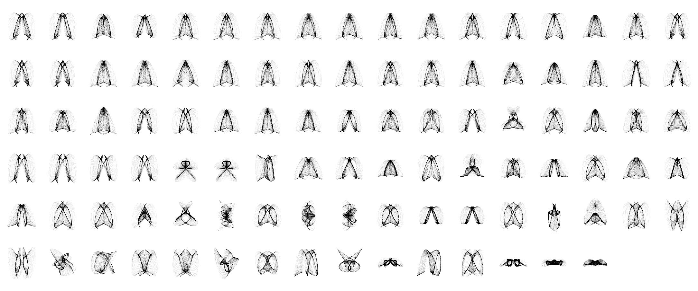

# Evolving harmonographs

This tutorial covers the application of a Genetic Algorithm on a generative design process. The goal is to evolve computer-generated drawings. In particular, we will be evolving [harmonographs](https://en.wikipedia.org/wiki/Harmonograph). To be precise, we will evolve a set of parameters that control the algorithmic drawing of harmonographs.

*Population of harmonographs evolved to resemble the letter A*

### Modules

The tutorial is structured as a series of modules:

1. Hello harmonograph
2. Random harmonographs
3. Interactive evolution of harmonographs
4. Automatic evolution of harmonographs

### Credits

This activity was created by [Penousal Machado](https://cdv.dei.uc.pt/authors/penousal-machado/), [Tiago Martins](http://cdv.dei.uc.pt/people/tiago-martins/) and [Sérgio Rebelo](https://cdv.dei.uc.pt/authors/sergio-rebelo/).