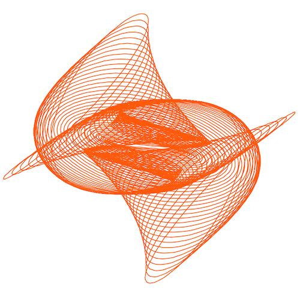

### Hello harmonograph!

This program draws a harmonograph which is defined by several parameters. Try adjusting the parameters and see the resulting harmonograph.

Find more information about harmonographs, including the equation that generates them, at [https://en.wikipedia.org/wiki/Harmonograph](https://en.wikipedia.org/wiki/Harmonograph).