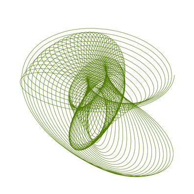

### Random harmonographs

This program creates different harmonographs and enables interaction with the drawing process, namely the adjustment of the line length and the density of the points that define the line.

